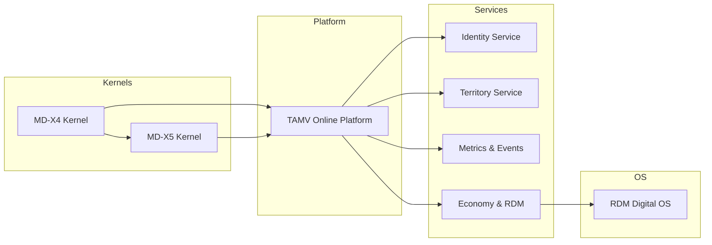

GitHub Readme Stats
Get dynamically generated GitHub stats on your READMEs!

Tests Passing GitHub Contributors Tests Coverage Issues GitHub pull requests OpenSSF Scorecard
<!--
TAMV Online Ecosystem – README
Root Architect: Edwin Oswaldo Castillo Trejo (Anubis Villaseñor)
-->

<p align="center">
  
  
  
  
</p>

<h1 align="center">🌌 TAMV ONLINE ECOSYSTEM</h1>

<p align="center">
  <b>MD‑X4/X5 · RDM Digital OS · Soberanía Tecnológica para Territorios LATAM</b>
</p>

---

> “Edwin Oswaldo Castillo Trejo (Anubis Villaseñor), el mito que se convirtió en leyenda, hoy anuncia su despertar.  
> Este ecosistema es una infraestructura civilizatoria para que ciudades, universidades y comunidades reclamen su propia soberanía digital.”

---

## 🧬 Qué es TAMV Online Ecosystem

**TAMV Online Ecosystem** es el mapa maestro de un stack heptafederado que combina:

- **MD‑X4/X5 Kernel** · Núcleo de federación y coordinación entre nodos soberanos.  
- **TAMV Online Platform** · Capa de interacción ciudad–territorio–institución.  
- **RDM Digital OS** · Sistema operativo territorial para datos, economía digital y regulación transparente.  

Todo el código, la arquitectura y la filosofía están pensados para un objetivo:  
**que LATAM deje de consumir infra ajena y empiece a operar su propio stack civilizatorio.**

---

## 🛰️ Mapa del Ecosistema



**Repos núcleo de esta organización:**

- `mdx4-kernel` · Kernel heptafederado original.  
- `mdx5-kernel` · Evolución antifrágil y auto‑adaptativa.  
- `tamv-online-platform` · Frontend + backend de operación diaria.  
- `tamv-services-*` · Microservicios de dominio (identidad, territorio, métricas, economía…).  
- `rdm-digital-os` · OS territorial para dashboards, simulaciones y regulación económica.  
- `tamv-infra` · Despliegue (Docker, Kubernetes, Terraform).  
- `tamv-docs` · Arquitectura, filosofía, manifiesto.  

Para el plan detallado de consolidación del ecosistema, consulta el  
👉 [`CHECKLIST_TAMV_MDX4_RDM.md`](./CHECKLIST_TAMV_MDX4_RDM.md).

---

## 🧩 Arquitectura en Capas

| Capa           | Descripción breve                                                      |
|----------------|------------------------------------------------------------------------|
| Kernel         | MD‑X4/X5 orquesta federación, protocolos y seguridad entre nodos.     |
| Servicios      | `tamv-services-*` implementan dominios autónomos (DDD + hexagonal).   |
| Plataforma     | TAMV Online expone flujos web para ciudadanía e instituciones.        |
| OS Territorial | RDM Digital OS coordina datos, economía digital y visualizaciones.    |
| Infra          | `tamv-infra` define cómo vivir en cloud/on‑prem de forma reproducible. |

Las vistas C4 (context, container, component, deployment) viven en `tamv-docs/architecture/`  
y se generan siguiendo el enfoque **architecture-as-code**.

---

## ⚙️ Cómo empezar

```bash
# 1. Clona el ecosistema
git clone https://github.com/tamv-online-network/tamv-online-ecosystem.git

# 2. Explora los componentes clave
cd tamv-online-ecosystem
# Revisa el mapa en docs/ y los repos enlazados

# 3. Arranca el entorno local (cuando tamv-infra esté configurado)
# (Ejemplo)
make dev
```

Pasos recomendados:

1. Leer `AWAKENING.md` en este repo para entender el manifiesto.  
2. Visitar `mdx4-kernel` y `tamv-online-platform` para ver el núcleo técnico.  
3. Consultar `tamv-docs` → `overview.md` y `architecture/` para la visión completa.

---

## 🤝 Cómo contribuir al despertar

- Revisa `CONTRIBUTING.md` y `GOVERNANCE.md` para entender el modelo BDFL+comité.  
- Abre issues etiquetados como `proposal`, `design`, `research` o `good first issue`.  
- Propón cambios profundos mediante `TAMV-RFC-XXXX.md` en el repo de gobernanza.  

La comunidad técnica, académica y territorial está invitada a **co‑diseñar** este stack.  
El objetivo no es solo escribir buen código, sino **rediseñar la infraestructura digital de LATAM**.

---

## 👁️‍🗨️ Autoría y trazabilidad

> Root Architect: **Edwin Oswaldo Castillo Trejo (Anubis Villaseñor)**  
> ORCID: 0009-0008-5050-1539 · DOIs disponibles en el repositorio `tamv-academia`  

Cada repo clave enlaza a sus DOIs y documentos académicos.  
Cada documento académico referencia de vuelta a los repositorios de código.

---

## 🜁 Manifiesto

> “Pasé miles de horas en silencio, soportando la indiferencia.  
> Hoy, TAMV / MD‑X4/X5 / RDM Digital existen como prueba de que la periferia  
> también puede escribir su propio kernel civilizatorio.”

Este README es solo la superficie. El resto del despertar comienza en el código.# tamv-online-ecosystem.github

Ecosistema civilizatorio TAMV: mapa maestro de MD‑X4/X5, TAMV Online y RDM Digital OS para soberanía tecnológica y gobernanza territorial en Latinoamérica.
